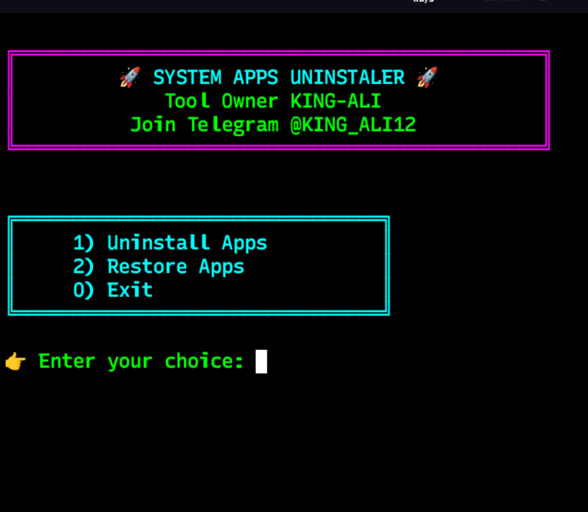
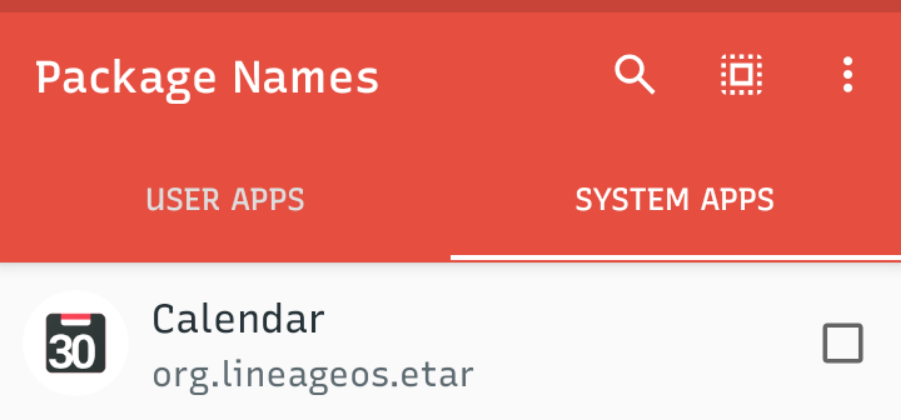
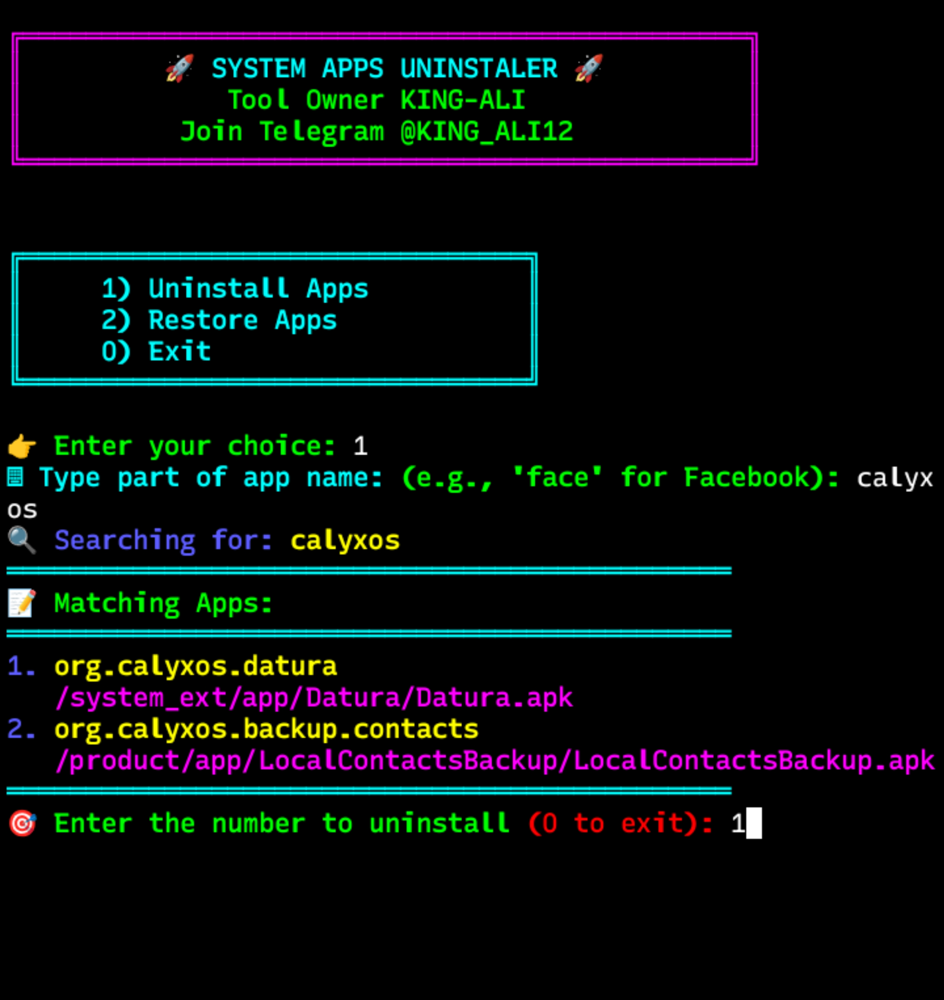
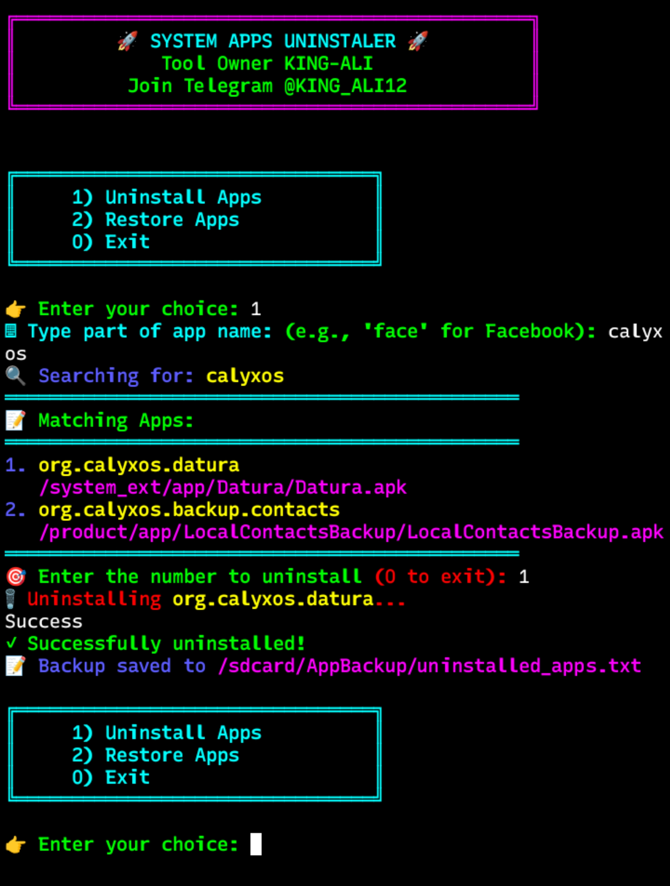
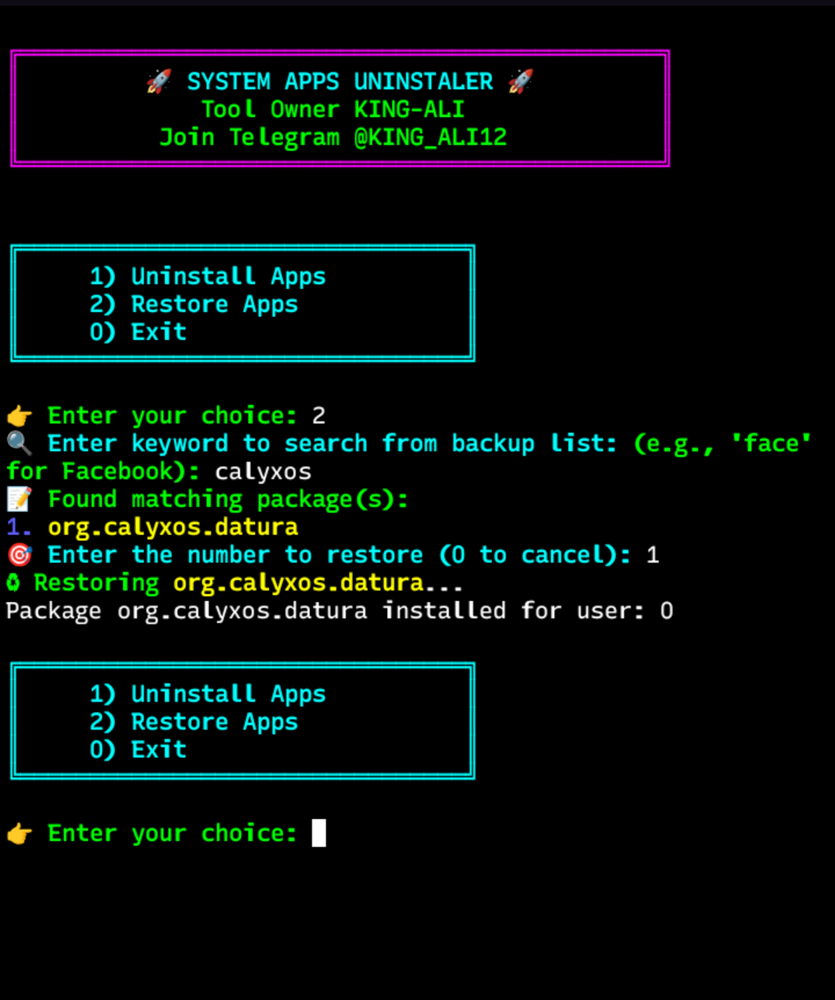

# 🚀 System Apps Uninstaller for Android (Termux)
This is a Termux script to:

🔍 Search apps by name

🗑 Uninstall system/user apps

📝 Save the uninstalled package names

♻ Restore those apps later using the saved list

A simple yet powerful Bash script that helps you **search**, **select**, and **uninstall system apps** directly from Termux with root access.

> 🔥 Created by **KING-ALI**
> 📢 Join Telegram: [@KING_ALI12](https://t.me/KING_ALI12)

---

## 📦 Features

- 🔍 Search system apps by name (partial match supported)
- 🧾 Automatically logs all uninstalled apps to a backup file
- 📁 Backups packages stored in `/sdcard/AppBackup/uninstalled_apps.txt`
- 🎨 Beautiful colored terminal UI for easy navigation
- ✅ Search & Uninstall any installed app (system or user)  
- ✅ Backup uninstalled package names to file  
- ✅ Restore previously uninstalled apps by keyword  
- ✅ Root check built-in  
- ✅ Stylish colored terminal UI  
- ✅ Fully works in **Termux** on rooted Android devices


---

## ⚙️ Requirements

- Android phone rooted
- Package Name Viewer apk
- [Download apk](https://play.google.com/store/apps/details?id=com.csdroid.pkg)
- [Termux](https://f-droid.org/en/packages/com.termux/)
- Root access inside Termux (`su` command must work)

---

## 🚀 Installation & Usage

### **1. Open Termux**

```
pkg update && pkg install git -y
git clone https://github.com/King-Ali12/System-Apps-Delete.git
```
### **2. Give it permission to run:**
```
chmod +x uninstaller
```
### **3. Make sure you have root access:**
   Run this command:-
  ```
su
```
### **4. Run the script:**
```
./uninstaller
```

### **🧩 Menu Options**
```
╔════════════════════════════════╗
║     1) Uninstall Apps                ║
║     2) Restore Apps                  ║
║     0) Exit                          ║
╚════════════════════════════════╝
```
### **💡 Example: Uninstall App**<br>
   👉 Enter your choice: 1<br>
   ⌨ Type part of app name: face<br>
   🔍 Searching for: face<br>
   1. com.facebook.katana<br>
   /system/app/Facebook/Facebook.apk<br>
   🎯 Enter the number to uninstall: 1<br>
   🗑 Uninstalling com.facebook.katana...<br>
   ✓ Successfully uninstalled!<br>
   📝 Package saved to log: com.facebook.katana<br>


### **♻️ Example: Restore App**
   👉 Enter your choice: 2<br>
   🔍 Enter keyword to search from backup list: face<br>
    1. com.facebook.katana<br>
   🎯 Enter the number to restore: 1<br>
   ♻ Restoring com.facebook.katana...<br>


## 📝 How It Works
* Download The Package name viewer apk from the playstore and install it after that open and search apk which you want uninstall 
* The script lists installed apps and lets you search by a keyword (e.g., "face").
* You choose which app to uninstall from the list.
* If successful, it logs the uninstalled app details (package name + APK path) to:

```
  /sdcard/AppBackup/uninstalled_apps.txt
  ```
## **⚠️ Don't Delete uninstalled_apps.txt File If You Delete This File Then You Can Not Restore Deleted Apps Easily
## You Need Package Name For Restore Apps**
### **If You Want Restore Delete Apps Check uninstalled_apps.txt
### Here Save All Deleted Apk Package Name**


## 👑 Credits

* 💡 Script by: **KING-ALI**
* 🗨️ Telegram: [@KING_ALI12](https://t.me/KING_ALI12)

### 🧩 Step 1 - **Launch the Tool**

:
---

### 🔍 Step 2 - Download Package Names Viewer
Search Apk Which You Want Uninstall:

:
---

### 🔍 Step 3 - Keywords Search
Package name like `org.lineageos.etar`
You type only **`line`, `etar`** — any two words or more, then press Enter:

:

---
### 🗑️ Step 4 - **Select Apk and Uninstall**
Checked Carefully Package Name Which APK You Want to Uninstall:

:

---
### **Restore The Uninstall Apps**
Press 2 For Restore Deleted App 
Enter The Package Name 
If Uninstall Package Name txt File is Present Then No need Enter Full Package Name
If File Not present Then Enter Full Package Name

:

## ⚠️ Disclaimer

* ⚠️ **Use at your own risk**. Uninstalling essential system apps may break your device.
* 🛑 Always double-check before confirming an uninstallation.

---


 
